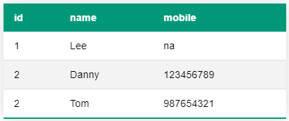

# @leewinter/auto-table

Simple react component to auto generate tables from arrays or objects

```javascript
import { AutoTable } from "@leewinter/auto-table";
// Not required if built in styles aren't used
import "@leewinter/auto-table/dist/styles.css";

const testData = [
      { id: 1, name: "Lee", mobile: "na" },
      { id: 2, name: "Danny", mobile: "0192272727" },
      { id: 3, name: "Tom", mobile: "987654321" },
      { id: 4, name: "Mark", mobile: "000000000" }
    ];

// From array
<AutoTable data={testData} />

// From object
<AutoTable data={testData[0]} tableClass="styled-table" />
```

### Styling

Table class can be set via tableClass param. Default is `tableClass="styled-table"`

Selected row will be given `active-row` class

The following is only required if the built in styles are needed

`import "@leewinter/auto-table/dist/style.css";`


