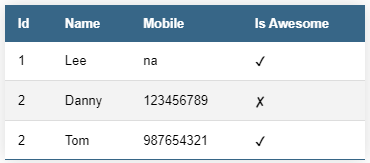

# @leewinter/auto-table

Simple react component to auto generate tables from arrays or objects

```javascript
import { AutoTable } from "@leewinter/auto-table";
// Not required if built in styles aren't used
import "@leewinter/auto-table/dist/styles.css";

const testData = [
      { id: 1, name: "Lee", mobile: "na" },
      { id: 2, name: "Danny", mobile: "0192272727" },
      { id: 3, name: "Tom", mobile: "987654321" },
      { id: 4, name: "Mark", mobile: "000000000" }
    ];

// From array
<AutoTable data={testData} />

// From object
<AutoTable data={testData[0]} tableClass="styled-table" />
```

### Styling

Table class can be set via tableClass param. Default is `tableClass="styled-table"`



Selected row will be given `active-row` class

The following is only required if the built in styles are needed

`import "@leewinter/auto-table/dist/style.css";`

Current built in styles as follows:-

```css
:root {
  --bg-color-head: #376687;
  --txt-color-hd: #ffffff;
  --border-color-tr: #dddddd;
  --bg-color-even-row: #f3f3f3;
  --border-color-bot-tr: #376687;
  --txt-color-active: #376687;
}

.styled-table {
  border-collapse: collapse;
  margin: 25px 0;
  font-size: 0.9em;
  font-family: sans-serif;
  min-width: 400px;
  box-shadow: 0 0 20px rgba(0, 0, 0, 0.15);
}

.styled-table thead tr {
  background-color: var(--bg-color-head);
  color: var(--txt-color-hd);
  text-align: left;
}

.styled-table th,
.styled-table td {
  padding: 12px 15px;
}

.styled-table tbody tr {
  border-bottom: 1px solid var(--border-color-tr);
}

.styled-table tbody tr:nth-of-type(even) {
  background-color: var(--bg-color-even-row);
}

.styled-table tbody tr:last-of-type {
  border-bottom: 2px solid var(--border-color-bot-tr);
}

.styled-table tbody tr.active-row {
  font-weight: bold;
  color: var(--txt-color-active);
}
```
